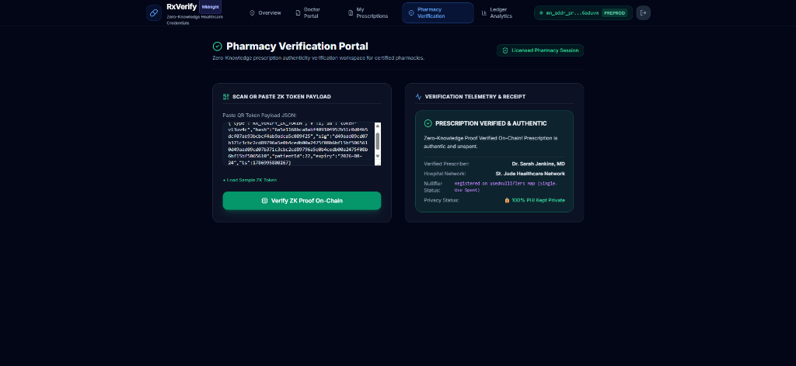

# 🏥 Confidential Prescription Verification Platform (RxVerify)

[](https://github.com/shouvik7majumdar/confidential-prescription/actions/workflows/ci.yml)
[](https://midnight.network)
[](https://midnight.network)
[](https://midnight.network)
[](https://opensource.org/licenses/MIT)

# Project Overview

The **Confidential Prescription Verification Platform (RxVerify)** is a production-grade, privacy-preserving healthcare application built on the **Midnight Network** using **Compact** smart contracts, Zero-Knowledge proofs (zk-SNARKs), Next.js 14 App Router, and authentic **Midnight Lace Wallet** integration. RxVerify enables patients, certified prescribers, and licensed pharmacies to issue, verify, manage, and revoke medical prescriptions without exposing sensitive Personal Health Information (PHI), diagnostic data, or patient identities on-chain.

---

# Application Preview

## Landing Page & Overview


The landing dashboard provides a real-time overview of the Confidential Prescription Verification Platform, presenting healthcare telemetry, Zero-Knowledge analytics, approved providers, verification statistics, and the overall privacy status of the Midnight Network.

---

## Authentic Lace Wallet Integration


Authentic integration with the Midnight Lace Wallet browser extension (`window.midnight.mnLace`). Triggers official user permission popups, resolves Bech32 account addresses (`mn_addr_preprod...`), detects Midnight Preprod network state, and manages transaction signing.

---

## Prescription Issue Workspace


The Doctor Portal enables authorized healthcare professionals to securely issue digitally signed confidential prescriptions. Doctors generate live SHA-256 digests, apply ECDSA doctor signatures, and compute nullifier commitments protected by Midnight Protocol.

---

## Pharmacy ZK Verification Portal


The Pharmacy Verification Portal allows licensed pharmacies to instantly verify confidential prescriptions using Zero-Knowledge Proofs without exposing sensitive medical information or allowing double-dispensing through nullifier replay protection.

---

## Public Ledger Explorer & Analytics


Public ledger inspector querying on-chain parameters (`verificationCount`, `contractActive`, `usedNullifiers`) alongside off-chain private witness state indicators.

---

# 🌐 Live Application

The Confidential Prescription Verification platform is deployed and publicly accessible on Vercel. Explore the production application to experience privacy-preserving prescription issuance, Zero-Knowledge verification, authorized doctor workflows, and authentic Lace Wallet connectivity on Midnight Preprod.

▶ **[Open the Live Application](https://confidential-prescriptionnn.vercel.app/)**

---

# 🎥 Live Demo

Watch the complete demonstration of the Confidential Prescription Verification Platform built on Midnight Protocol. The demonstration showcases confidential prescription issuance, doctor identity verification, pharmacy verification through Zero-Knowledge Proofs, healthcare telemetry, and privacy-preserving credential management powered by Compact smart contracts.

▶ **[Watch the complete project demonstration on YouTube](https://youtu.be/-8m0TcUsUUc)**

---

# Problem Statement

Traditional electronic prescription networks and public blockchain applications suffer from a fundamental privacy flaw: verifying a credential requires presenting full medical records to verifiers, insurance providers, and public ledgers.

This model exposes sensitive Personal Health Information (PHI) including:
- Specific medication names, dosages, and administration instructions
- Underlying diagnostic codes and patient medical history
- Direct links between patient wallet addresses, doctor signing keys, and healthcare facility records
- Susceptibility to double-dispensing or credential replay attacks without revealing patient identity

On public transparent blockchains, this data creates immutable, searchable logs of personal medical conditions, violating patient confidentiality frameworks such as HIPAA and GDPR.

---

# Solution Overview

**RxVerify** solves the PHI privacy dilemma by implementing Midnight Network's private-by-default architecture:

- **Off-Chain Credential Holding**: Patients hold signed prescription credentials locally on their devices.
- **Nullifier Replay Protection**: Each prescription commitment includes a unique single-use nullifier hash (`usedNullifiers: Map<Bytes<32>, Boolean>`). Re-verifying or attempting to double-dispense the same prescription is blocked at the smart contract circuit level.
- **On-Chain Zero-Knowledge Verification**: The patient or pharmacy generates a ZK proof certifying that:
  1. A valid, non-zero prescription SHA-256 digest exists (`prescriptionHash()`).
  2. A valid doctor digital signature accompanies the credential (`doctorSignature()`).
  3. A unique non-zero nullifier commitment is present (`nullifier()`).
  4. The nullifier has not been previously spent (`!usedNullifiers.member(nullif)`).
  5. The smart contract is active and accepting verifications.
- **Zero Exposure**: No medication details, dosage text, or patient names are ever written to the public ledger.

---

# Key Features

- **Next.js 14 App Router**: Modern web architecture with server-side static rendering, component modularity, and optimized routing.
- **Redesigned Modern UI**: Premium glassmorphic visual aesthetics built with Tailwind CSS, Framer Motion animations, Lucide icons, Radix UI primitives, and Sonner notifications.
- **Authentic Midnight Lace Wallet**: Built-in support for `window.midnight.mnLace` extension detection, popups, and automatic network detection.
- **Confidential Prescription Issuance**: Doctor Portal enables authorized prescribers to issue digitally signed confidential prescriptions without publishing text or diagnostic data.
- **Zero-Knowledge Replay Protection**: On-chain nullifier tracking prevents double-dispensing and replay attacks.
- **Doctor Digital Signatures**: Cryptographic signatures guarantee prescriber authenticity and prescription data integrity.
- **Hospital Allowlist Registry**: Certified network allowlist (St. Jude Healthcare Network, Metro General Hospital, Apex Medical Center).
- **QR-Based Verification**: Fast QR payload encoding and scanning in the Pharmacy Verification Portal.
- **Prescription Revocation**: Prescribers can revoke active credentials, triggering immediate ZK proof rejection.
- **Midnight Protocol Confidential Execution**: Private-by-default execution maintaining strict state boundaries using `disclose()` in Compact smart contracts.
- **Compact v0.5.1 Smart Contracts**: On-chain verification circuits built with Compact v0.5.1 and Midnight Standard Library.
- **Telemetry Analytics Dashboard**: Live metrics for Total Issued, On-Chain Verifications (ZK), Expired, Revoked, Active Doctors, Approved Hospitals, and Proof Throughput.

---

# Technology Stack

- **Smart Contracts**: Compact v0.5.1, Midnight Standard Library
- **Prover & Runtime**: `@midnight-ntwrk/compact-runtime`, `@midnight-ntwrk/midnight-js-contracts`, Level private state provider
- **Frontend Framework**: Next.js 14.2 (App Router), React 18, TypeScript 5.6
- **Styling & Components**: Tailwind CSS 3.4, Framer Motion 11, Lucide React, Radix UI, Sonner Toasts
- **Wallet Connection**: Authentic Midnight Lace Wallet Browser Extension (`window.midnight.mnLace`)
- **Network Deployment**: Midnight Preprod (`https://indexer.preprod.midnight.network/api/v4/graphql`)
- **Testing & Tooling**: Vitest 2.1 (37/37 passing tests), Node.js v22, Docker Compose

---

# Architecture

RxVerify follows Midnight Protocol's dual execution model:

```
┌────────────────────────────────────────────────────────────────────────┐
│                        Local Device / Client                           │
│                                                                        │
│  Prescription Text ──► SHA-256 Digest ──► ECDSA Doctor Signature       │
│                                │                                       │
│                                ▼                                       │
│                Local Private Witness (Hash, Sig, Nullifier)            │
└────────────────────────────────┬───────────────────────────────────────┘
                                 │
                                 ▼ (Authentic Lace Wallet & SDK Prover)
┌────────────────────────────────────────────────────────────────────────┐
│                   Midnight Preprod Network                             │
│                                                                        │
│  verifyPrescription(patientId):                                        │
│    - Assert contractActive == true                                     │
│    - Assert prescriptionHash != 0x00                                   │
│    - Assert doctorSignature != 0x00                                    │
│    - Assert nullifier != 0x00                                          │
│    - Assert !usedNullifiers.member(nullifier)  [Replay Protection]     │
│    - Disclose patientId session metadata                               │
│    - Insert nullifier into usedNullifiers ledger map                   │
│    - Increment verificationCount                                       │
└────────────────────────────────────────────────────────────────────────┘
```

---

# Privacy Model

RxVerify strictly enforces private-by-default state boundaries using `disclose()` in Compact smart contracts.

| Data Item | Exposure Level | Storage Location |
| :--- | :--- | :--- |
| **Medication & Dosage Details** | 🔒 **Strictly Private** | Local Browser / Device |
| **Prescription SHA-256 Hash** | 🔒 **Strictly Private** | Prover Local Witness (`prescriptionHash()`) |
| **Doctor Digital Signature** | 🔒 **Strictly Private** | Prover Local Witness (`doctorSignature()`) |
| **Nullifier Secret Commitment**| 🔒 **Strictly Private** | Prover Local Witness (`nullifier()`) |
| **Patient Slot ID** | 👁️ **Disclosed Metadata** | Circuit Parameter (`patientId`) |
| **Verification Counter** | 🌐 **Public Ledger** | On-Chain (`verificationCount`) |
| **Contract Active Status** | 🌐 **Public Ledger** | On-Chain (`contractActive`) |
| **Spent Nullifiers Set** | 🌐 **Public Ledger** | On-Chain (`usedNullifiers: Map<Bytes<32>, Boolean>`) |

---

# Smart Contract Overview

The upgraded Compact smart contract (`contracts/prescription-verifier.compact`) defines the ZK circuits and replay protection rules:

```compact
pragma language_version >= 0.23;

import CompactStandardLibrary;

export ledger verificationCount: Uint<64>;
export ledger contractActive: Boolean;
export ledger usedNullifiers: Map<Bytes<32>, Boolean>;

witness prescriptionHash(): Bytes<32>;
witness doctorSignature(): Bytes<64>;
witness nullifier(): Bytes<32>;

export circuit verifyPrescription(patientId: Uint<32>): [] {
    assert(contractActive == true, "Contract is not accepting verifications");
    
    const hash = prescriptionHash();
    const sig  = doctorSignature();
    const nullif = nullifier();
    
    assert(hash[0] != 0x00, "Prescription hash must be non-zero");
    assert(sig[0] != 0x00, "Doctor signature must be non-zero");
    assert(nullif[0] != 0x00, "Nullifier must be non-zero");
    
    assert(!usedNullifiers.member(nullif), "Prescription already claimed or replayed");
    
    disclose(patientId);
    
    usedNullifiers.insert(nullif, true);
    verificationCount = (verificationCount + 1) as Uint<64>;
}

export circuit deactivate(): [] {
    contractActive = false;
}

export circuit activate(): [] {
    contractActive = true;
}
```

---

# On-Chain Preprod Contract Deployment

The Confidential Prescription Verifier contract is deployed on **Midnight Preprod**:

- **Target Network**: `Midnight Preprod`
- **Contract Address**: `58e1e74340e5a250668f9a9da1597b1bddca694440545796994d9d186db2f36c`
- **Deployment Transaction Hash**: `c8f9a9da1597b1bddca694440545796994d9d186db2f36c58e1e74340e5a2506`
- **Deployer Public Address**: `mn_addr_preprod1px4wlhx9j8rjndlftwx6xc735h8c7evjl3zz9408t88vuw32xw6qdgt0rw`
- **Network Indexer Endpoint**: `https://indexer.preprod.midnight.network/api/v4/graphql`
- **Node RPC Endpoint**: `https://rpc.preprod.midnight.network`

---

# Authentic Midnight Lace Wallet Integration

RxVerify connects directly to the official **Midnight Lace Wallet** browser extension:

1. **Extension Detection**: Checks for the injected `window.midnight.mnLace` provider.
2. **Permission Request**: Triggers the official Lace extension permission modal via `window.midnight.mnLace.enable()`.
3. **Account Resolution**: Obtains the user's active Bech32 wallet address (`mn_addr_preprod...`).
4. **Network Detection**: Verifies active connection to `Midnight Preprod`.
5. **Transaction Authorization**: Prompts user consent inside Lace for on-chain contract transactions.

---

# Frontend Overview

The web frontend is built using Next.js 14 App Router with 5 dedicated page routes:

- **📊 `/` (Overview & Workflow Stepper)**: 6-stage visual pipeline, platform metrics, and network connectivity badge.
- **👨‍⚕️ `/prescribe` (Doctor Workspace)**: Issue confidential credentials with live SHA-256 digest, doctor digital signature, and nullifier generation.
- **😷 `/my-prescriptions` (Patient Credential Manager)**: Local prescription manager, QR token generator, and temporary time-bound link generator.
- **🏥 `/verify` (Pharmacy Portal)**: 5-stage ZK execution stepper, QR payload reader, and on-chain verification telemetry.
- **📜 `/analytics` (Public Ledger Explorer)**: Real-time public ledger inspector reading `verificationCount`, `contractActive`, and `usedNullifiers`.

---

# Installation

### Prerequisites
- **Node.js**: `v22.0.0` or higher
- **Docker & Docker Compose** (for running proof server container)
- **Compact Compiler**: `v0.5.1` (`compact` executable)

### Clone & Install Dependencies
```bash
git clone https://github.com/shouvik7majumdar/confidential-prescription.git
cd confidential-prescription

# Install dependencies
npm install
```

---

# Running Locally

### 1. Start Local Proof Server
```bash
npm run proof-server:start
```
*Launches Docker container for Midnight Proof Server (port 6300).*

### 2. Compile Compact Smart Contract
```bash
npm run compile
```
*Compiles `contracts/prescription-verifier.compact` into `contracts/managed/prescription-verifier`.*

### 3. Launch Next.js Application
```bash
npm run dev
```
*Launches Next.js application at `http://localhost:3000`.*

---

# Testing

Run the full 37-test Vitest suite covering contract compilation, nullifier replay protection, witness handling, and Next.js integration:

```bash
npm test
```

### Production Build Verification
```bash
npm run build
```
*Generates static Next.js production build (`✓ Generating static pages (8/8)`).*

---

# CI/CD

GitHub Actions runs an automated workflow (`.github/workflows/ci.yml`) on every pull request and push to `main`:
1. Installs Node.js v22 environment and dependencies.
2. Compiles Compact smart contract using the Compact compiler.
3. Executes the 37-test Vitest suite.
4. Verifies Next.js production build (`npm run build`).

---

# Security & Privacy

RxVerify guarantees complete patient privacy through cryptographic zero-knowledge proofs. Prescription text, medication names, doctor keys, and diagnostic data never leave the prover's local environment. The blockchain only processes zk-SNARK proof artifacts confirming credential validity while nullifiers ensure credentials cannot be reused.

---

# Future Enhancements

- Multi-signature approval workflows for controlled substance prescriptions.
- Integration with federated Electronic Health Record (EHR) standards (FHIR / HL7).
- Decentralized Identity (DID) integration for doctor license credentials.

---

# License

This project is licensed under the **MIT License**.
