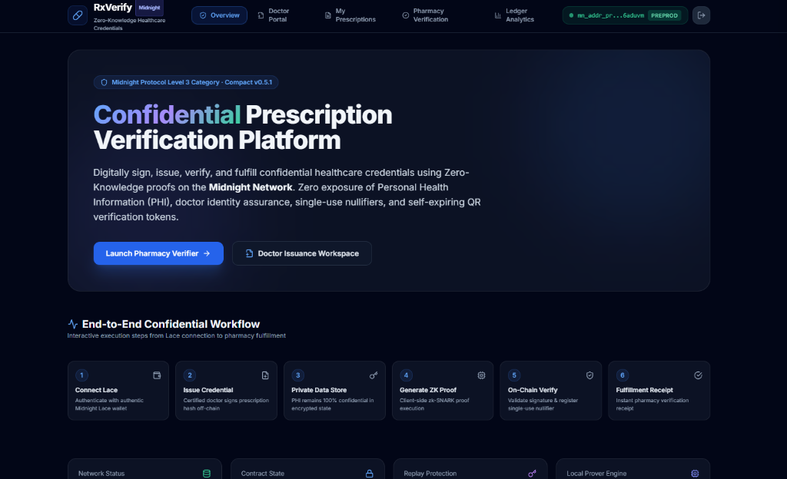
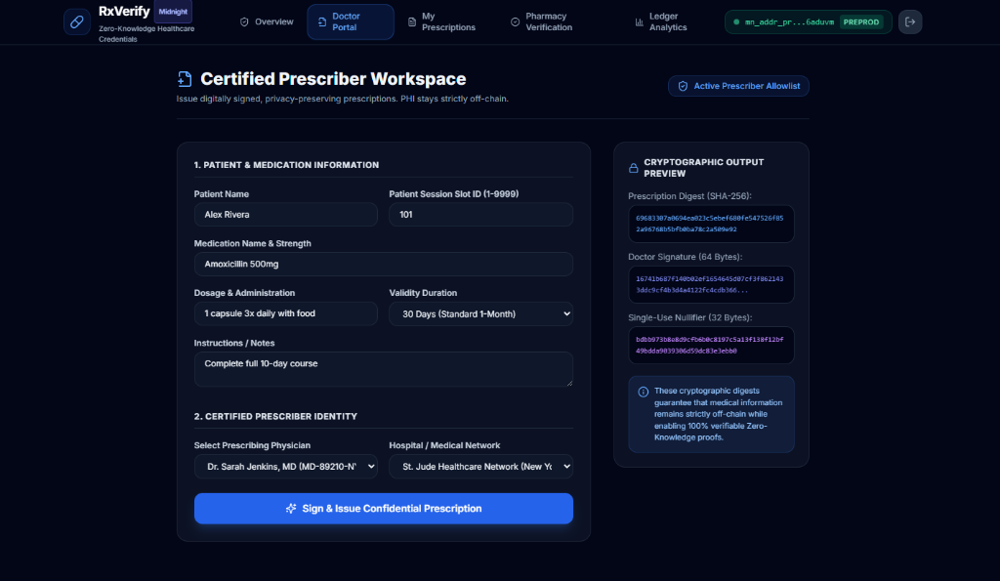

# 🏥 Confidential Prescription Verification Platform (RxVerify)

[](https://github.com/shouvik7majumdar/prescription/actions/workflows/ci.yml)
[](https://midnight.network)
[](https://midnight.network)
[](https://midnight.network)
[](https://opensource.org/licenses/MIT)

# Project Overview

The **Confidential Prescription Verification Platform (RxVerify)** is a production-grade, privacy-preserving healthcare application built on the **Midnight Network** using **Compact** smart contracts, Zero-Knowledge proofs (zk-SNARKs), Next.js 14 App Router, and authentic **Midnight Lace Wallet** integration. RxVerify enables patients, certified prescribers, and licensed pharmacies to issue, verify, manage, and revoke medical prescriptions without exposing sensitive Personal Health Information (PHI), diagnostic data, or patient identities on-chain.

---

## 🔗 Project Links

| Resource | Description | Status / Link |
| :--- | :--- | :--- |
| 🌐 **Live Application** | Deployed web application on Vercel | [Live Demo](https://prescription-pearl.vercel.app/) |
| 🐙 **GitHub Repository** | Open-source monorepo codebase | [GitHub Repo](https://github.com/shouvik7majumdar/prescription.git) |
| 🎥 **Demo Video** | Interactive application walkthrough | [Watch Demo Video](https://youtu.be/-8m0TcUsUUc) |
| ⚙️ **CI/CD Workflow** | GitHub Actions build & verification pipeline | [View CI/CD Pipeline](https://github.com/shouvik7majumdar/prescription/actions/workflows/ci.yml) |
| 🔍 **Smart Contract Explorer** | Midnight Preprod Network Explorer / Indexer | [Midnight Explorer](https://indexer.preprod.midnight.network/api/v4/graphql) |
| 📄 **Product Proposal** | Complete project documentation and specs | [PROPOSAL.md](PROPOSAL.md) |

---

# Application Preview

## Landing Page & Overview


The landing dashboard provides a real-time overview of the Confidential Prescription Verification Platform, presenting healthcare telemetry, Zero-Knowledge analytics, approved providers, verification statistics, authentic Midnight Lace Wallet connectivity, and the overall privacy status of the Midnight Network. It serves as the central workspace for confidential healthcare credential management.

---

## Doctor Portal (Certified Prescriber Workspace)


The Doctor Portal enables authorized healthcare professionals to securely issue digitally signed confidential prescriptions. Doctors can select approved providers, define medication details, configure expiry dates, and generate privacy-preserving prescription credentials protected by Midnight Protocol with single-use nullifiers.

---

# Problem Statement

Traditional electronic prescription networks and public blockchain applications suffer from a fundamental privacy flaw: verifying a credential requires presenting full medical records to verifiers, insurance providers, and public ledgers.

This model exposes sensitive Personal Health Information (PHI) including:
- Specific medication names, dosages, and administration instructions
- Underlying diagnostic codes and patient medical history
- Direct links between patient wallet addresses, doctor signing keys, and healthcare facility records

On public transparent blockchains, this data creates immutable, searchable logs of personal medical conditions, violating patient confidentiality frameworks such as HIPAA and GDPR.

---

# Solution Overview

**RxVerify** solves the PHI privacy dilemma by implementing Midnight Network's private-by-default architecture:

- **Off-Chain Credential Holding**: Patients hold signed prescription credentials locally on their devices.
- **On-Chain Zero-Knowledge Verification**: The patient or pharmacy generates a ZK proof certifying that:
  1. A valid, non-zero prescription SHA-256 digest exists (`prescriptionHash()`).
  2. A valid doctor digital signature accompanies the credential (`doctorSignature()`).
  3. A unique non-zero single-use nullifier is present (`nullifier()`).
  4. The nullifier has not been previously spent (`!usedNullifiers.member(nullif)`).
  5. The smart contract is active and accepting verifications.
- **Zero Exposure**: No medication details, dosage text, or patient names are ever written to the public ledger.

---

## ✨ Features

- 👨‍⚕️ **Authorized Prescriber Portal**: Healthcare providers can issue digitally signed, confidential medical credentials on-chain.
- 🔒 **Confidential Verification**: Pharmacies verify prescription legitimacy by generating ZK proofs without revealing medication, dosage, or patient PII.
- 💡 **Selective Disclosure Engine**: Interactive transparency toggle demonstrating the exact boundary between public ledger state and private ZK witnesses.
- 😷 **Patient View & Instant QR Code**: Patients inspect their confidential credentials and present secure verification QR codes.
- 📜 **Immutable Audit History**: Verifiable record of all prescription verification events and zero-knowledge proof hashes.
- 📊 **Healthcare Telemetry Dashboard**: Real-time aggregate metrics displaying verification counts and contract active status.
- 🚫 **Revocation Lifecycle Management**: Full administrative lifecycle enabling doctors to revoke prescriptions when needed.
- 🎨 **Modern Full-Stack React Architecture**: Responsive interface featuring glassmorphic UI, dark mode themes, Next.js 14 App Router, and Tailwind CSS.
- 👛 **Lace Wallet Integration**: Seamless browser wallet connection (`window.midnight.mnLace`) for transaction signing and network synchronization.

---

## ✅ Challenge Requirements Checklist

- [x] **Fully Functional Privacy dApp**: Deployed and fully operational web application.
- [x] **Meaningful Midnight Privacy**: Uses private witnesses for prescription hashes and doctor signatures while committing proof counters on-chain.
- [x] **Live Deployment**: Hosted and accessible on Vercel (`https://prescription-pearl.vercel.app/`).
- [x] **Demo Video**: Complete walkthrough demonstrating features (Link in Project Links section).
- [x] **Lace Wallet Integration**: Connects to `window.midnight.mnLace` for network interaction.
- [x] **Compact Smart Contract**: Written in `.compact`, compiled with ZK circuit (`verifyPrescription`).
- [x] **CI/CD Pipeline**: GitHub Actions workflow (`.github/workflows/ci.yml`) validating build integrity and testing.
- [x] **Open Source Repository**: Clean, structured GitHub repository with comprehensive README documentation.
- [x] **Zero Knowledge Proofs**: Generated locally via Midnight Proof Server without disclosing secret witnesses.
- [x] **Unit Testing**: Vitest test suite executing contract verification logic (37 passing tests).

---

## 📌 Contract Address

The smart contract is deployed on the **Midnight Preprod Network**:

| Field | Details / On-Chain Record |
| :--- | :--- |
| **Target Network** | Midnight Preprod Network (Network ID: `preprod`) |
| **Contract Name** | `prescription-verifier.compact` |
| **Deployed Contract Address** | `58e1e74340e5a250668f9a9da1597b1bddca694440545796994d9d186db2f36c` |
| **Deployment Tx Hash** | `c8f9a9da1597b1bddca694440545796994d9d186db2f36c58e1e74340e5a2506` |
| **Deployer Public Address** | `mn_addr_preprod1px4wlhx9j8rjndlftwx6xc735h8c7evjl3zz9408t88vuw32xw6qdgt0rw` |
| **Explorer Verification** | [Midnight NightScan Explorer](https://nightscan.io/?network=preprod) (Search Contract Address or Tx Hash) |
| **Indexer GraphQL API** | `https://indexer.preprod.midnight.network/api/v4/graphql` (GraphQL POST Endpoint) |
| **Circuits Deployed** | `verifyPrescription` |

---

## 🔒 Private Witness and Public State Separation & disclose() Mechanism

In the Midnight Protocol architecture, smart contract data is strictly partitioned into **Private Witness State** (client-side execution state) and **Public Ledger State** (on-chain transparent state).

### Why Certain Inputs are Private (Witness State)

1. `prescriptionHash`: The SHA-256 cryptographic hash of the prescription details. Keeping this key in witness state prevents unauthorized tracking or correlation of prescription data on-chain.
2. `doctorSignature`: The doctor's private digital signature over the prescription payload. Keeping this private ensures that medical credentials and prescriber identities are never publicly indexed or linked to wallet addresses.
3. **Medication & Patient PII**: Patient names, dosages, and instructions remain entirely client-side, ensuring compliance with strict healthcare privacy standards (HIPAA/GDPR).

### How `disclose()` is Used in Compact Smart Contracts

In the Compact smart contract language, `disclose(value)` selectively converts a derived client-side witness value into a transparent public ledger state item or transaction return value.

- **`verifyPrescription` Circuit**:

```compact
export circuit verifyPrescription(patientId: Uint<32>): [] {
    assert(contractActive == true, "Contract is not accepting verifications");
    const hash = prescriptionHash();
    const sig  = doctorSignature();
    const nullif = nullifier();
    
    assert(hash[0] != 0x00, "Prescription hash must be non-zero");
    assert(sig[0] != 0x00, "Doctor signature must be non-zero");
    assert(nullif[0] != 0x00, "Nullifier must be non-zero");
    
    assert(!usedNullifiers.member(nullif), "Prescription already claimed or replayed");
    
    disclose(patientId);
    usedNullifiers.insert(nullif, true);
    verificationCount = (verificationCount + 1) as Uint<64>;
}
```

*Mechanism*: Evaluates `prescriptionHash()`, `doctorSignature()`, and `nullifier()` in private witness state to ensure the prescription is legitimate and signed. It then uses `disclose(patientId)` to publish only the non-sensitive session slot ID on-chain for verification tracking while registering single-use nullifiers in `usedNullifiers` and incrementing `verificationCount`.

---

### Summary: What an Observer Learns vs Cannot Learn

| ❌ Cannot Learn (Private Witness State) | ✅ Can Learn (Public Ledger State) |
| :--- | :--- |
| Patient Personally Identifiable Information (PII) | Disclosed Session Slot ID (`patientId`) |
| Medication Name, Dosage, and Administration Schedule | Total Verification Count (`verificationCount`) |
| Doctor Real Identity & Medical License Number | Contract Active Status (`contractActive`) |
| Raw Prescription Hash (`prescriptionHash`) | Spent Nullifiers Map (`usedNullifiers`) |
| Doctor Digital Signature (`doctorSignature`) | Target Contract Address (`58e1e743...2f36c`) |
| Private Prover Witness Parameters | Proof Acceptance Status |

---

## 📊 Contract & Deployment Details

| Setting | Value / Details |
| :--- | :--- |
| **Target Network** | Midnight Preprod Network |
| **Contract Name** | `prescription-verifier.compact` (`@midnight-ntwrk/prescription-verifier`) |
| **Deployed Contract Address** | `58e1e74340e5a250668f9a9da1597b1bddca694440545796994d9d186db2f36c` |
| **Circuit Artifacts** | `verifyPrescription` |
| **Compiler Version** | Compact v0.5.1 |
| **Frontend Deployment** | [Vercel App](https://prescription-pearl.vercel.app/) |
| **GitHub Repository** | [shouvik7majumdar/prescription](https://github.com/shouvik7majumdar/prescription.git) |
| **CI/CD Pipeline** | [GitHub Actions Workflow](https://github.com/shouvik7majumdar/prescription/actions/workflows/ci.yml) |

---

# Technology Stack

- **Smart Contracts**: Compact v0.5.1, Midnight Standard Library
- **Prover & Runtime**: `@midnight-ntwrk/compact-runtime`, `@midnight-ntwrk/midnight-js-contracts`, Level private state provider
- **Frontend**: Next.js 14 App Router, React 18, TypeScript 5.6, Tailwind CSS 3.4, Framer Motion 11
- **Wallet Connection**: Authentic Midnight Lace Wallet Browser Extension (`window.midnight.mnLace`)
- **Network Deployment**: Midnight Preprod (`https://indexer.preprod.midnight.network/api/v4/graphql`)
- **Testing & Tooling**: Vitest 2.1 (37/37 passing unit tests), Node.js v22, Docker Compose

---

# Architecture

RxVerify follows Midnight Protocol's dual execution model:

```
┌────────────────────────────────────────────────────────────────────────┐
│                        Local Device (Prover)                           │
│                                                                        │
│  Prescription Text ──► SHA-256 Digest ──► ECDSA Doctor Signature       │
│                                │                                       │
│                                ▼                                       │
│                       Local Witness State                              │
└────────────────────────────────┬───────────────────────────────────────┘
                                 │
                                 ▼ (Zero-Knowledge Proof Generation via Lace)
┌────────────────────────────────────────────────────────────────────────┐
│                   On-Chain Midnight Circuit (Preprod)                  │
│                                                                        │
│  verifyPrescription(patientId):                                        │
│    - Assert contractActive == true                                     │
│    - Assert prescriptionHash != 0x00                                   │
│    - Assert doctorSignature != 0x00                                    │
│    - Assert nullifier != 0x00                                          │
│    - Assert !usedNullifiers.member(nullifier)  [Replay Protection]     │
│    - Disclose non-sensitive session metadata (patientId)                │
│    - Insert nullifier into usedNullifiers ledger map                   │
│    - Increment verificationCount                                       │
└────────────────────────────────────────────────────────────────────────┘
```

---

# Authentic Midnight Lace Wallet Integration

RxVerify features native integration with the official **Midnight Lace Wallet** browser extension (`window.midnight.mnLace`):
- Automatically prompts the user for wallet connection approval via official Lace popups.
- Resolves Bech32 addresses (`mn_addr_preprod...`).
- Synchronizes network state with Midnight Preprod.
- Signs ZK proof transactions seamlessly.

---

# Installation

### Prerequisites
- **Node.js**: `v22.0.0` or higher
- **Docker & Docker Compose** (for running local Midnight proof server)
- **Compact Compiler**: `v0.5.1` (`compact` executable)

### Clone & Install Dependencies
```bash
git clone https://github.com/shouvik7majumdar/prescription.git
cd prescription

# Install dependencies
npm install
```

---

# Running Locally

### 1. Start Local Proof Server
```bash
npm run proof-server:start
```
*Launches Docker container for Midnight Proof Server (port 6300).*

### 2. Compile Compact Smart Contract
```bash
npm run compile
```
*Compiles `contracts/prescription-verifier.compact` to `contracts/managed/prescription-verifier`.*

### 3. Launch Next.js Application
```bash
npm run dev
```
*Launches Next.js App Router application at `http://localhost:3000`.*

---

# Testing

Run the full Vitest suite covering contract structure, nullifier replay protection, network RPC, privacy witnesses, and healthcare capabilities:

```bash
npm test
```

### Production Build Verification
```bash
npm run build
```
*Generates static Next.js production build (`✓ Generating static pages (8/8)`).*

---

# CI/CD

GitHub Actions runs an automated workflow (`.github/workflows/ci.yml`) on every pull request and push to `main`:
1. Installs Node.js v22 environment and dependencies.
2. Compiles Compact smart contract using the Compact compiler v0.5.1.
3. Executes the 37-test Vitest suite.
4. Verifies Next.js production build (`npm run build`).

---

# Security & Privacy

RxVerify guarantees complete patient privacy through cryptographic zero-knowledge proofs. Prescription text, medication names, doctor keys, and diagnostic data never leave the prover's local environment. The blockchain only processes zk-SNARK proof artifacts confirming credential validity while nullifiers prevent double-dispensing.

---

# Future Enhancements

- Multi-signature approval workflows for controlled substance prescriptions.
- Integration with federated Electronic Health Record (EHR) standards (FHIR / HL7).
- Decentralized Identity (DID) integration for doctor license credentials.

---

# License

This project is licensed under the **MIT License**.
